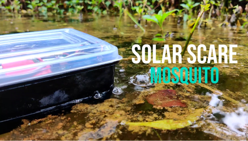

# MosquitoSense

An autonomous device used to collect wing beat data of mosquitoes and destroy mosquito larvae by agitating the water. This collected data is then used to determine the species of mosquito using a pre-trained ML model

[Project video](https://youtu.be/pREORyMNx1M)
