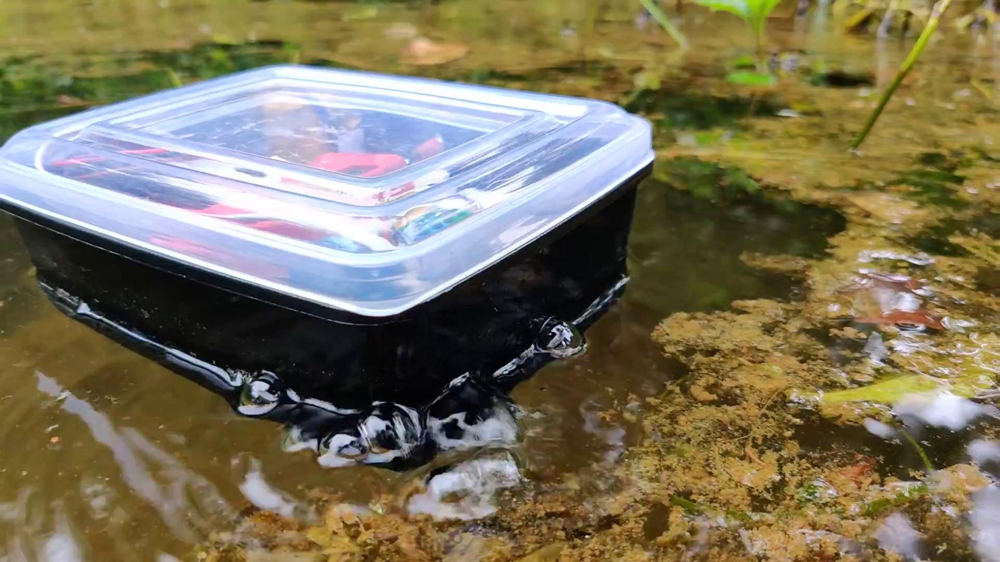
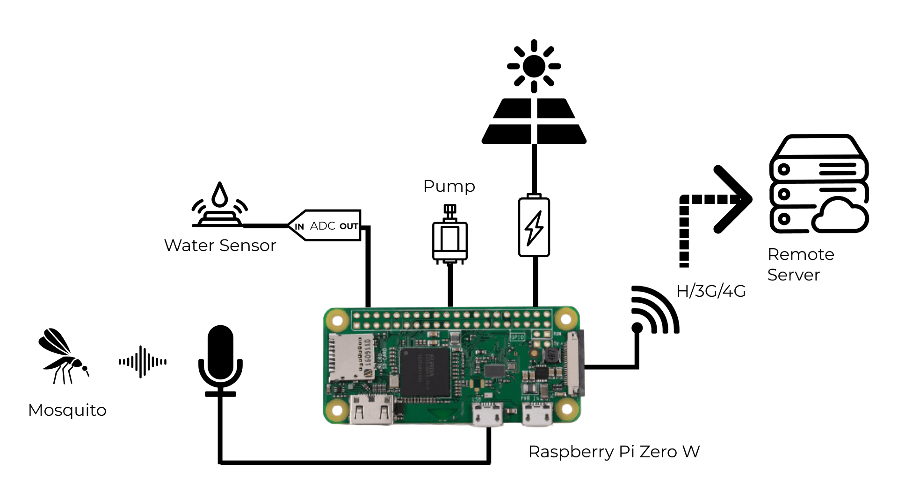
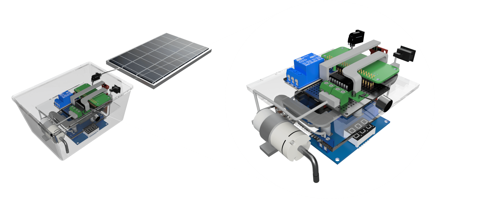

# MosquitoSense

MosquitoSense is an autonomous device that collects wing beat data from mosquitoes and destroys mosquito larvae by agitating the water. The collected data is then analyzed using a pre-trained machine learning model to identify the species of mosquito.

Designed to be cost-effective and environmentally friendly, this device offers a practical solution for controlling mosquito populations and reducing the spread of mosquito-borne diseases. It provides valuable insights about mosquito populations in the area, enabling the development of targeted and effective mosquito control strategies.

  
  
Mosquitosense - Diagram

  
  
Mosquitosense - 3D render

